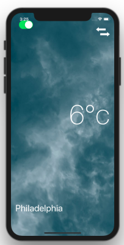
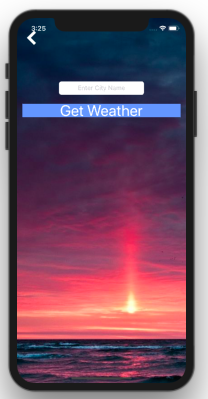
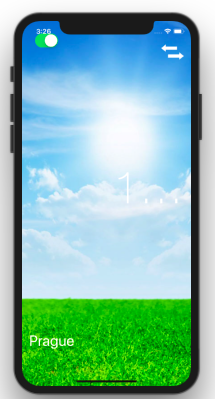

# BasicWeatherApp
Made use of openweathermap API, JSON parsing, and cocoa pods to create a fully functional weather application that pulls a users location. Also updates the users background screen based on the associated weather conditions in their location.

Download the starter project files as .zip and extract to your desktop. 

## Finished App




## Fix for Cocoapods v1.0.1 and below

```ruby
post_install do |installer|
  installer.pods_project.targets.each do |target|
    target.build_configurations.each do |config|
      config.build_settings['SWIFT_VERSION'] = '3.0'
      config.build_settings['MACOSX_DEPLOYMENT_TARGET'] = '10.10'
    end
  end
end
```
Copyright 2018 Montgomerys Designs
